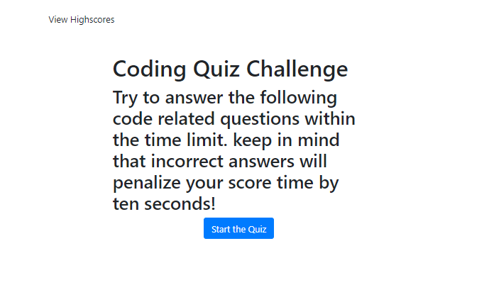
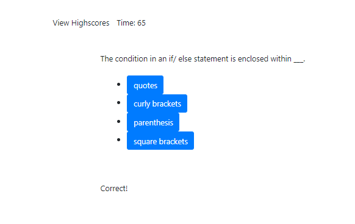
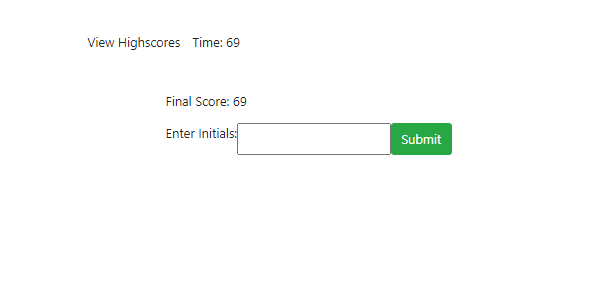

# gt-coding-quiz

## Description
This webpage serves as a coding quiz. It generates the the questions and answer choices dynamically by intializing through an array containing the question/answer objects. A timer begins when the user presses the "start button." When the user chooses a wrong answer, their time is reduced by fifteen seconds, and they will be notified that it was the wrong choice. In turn, if their choice is correct, they will be accurately notified. Each click of a selection cycles to the next index. The final score is the time remaining on the quiz. Eventually, the user will be able to save their highscores, but for now that is not implemented.

## Installation

This code can be forked and cloned onto one's local device through GitHub. Please make sure you are using the correction applications for administering this code onto your device, such as Terminal and Visual Studio Code.

## Usage

The primary usage of this code is to randomly generate a password for the user.

## Links
[GitHub repository](https://github.com/cheacliatt/gt-coding-quiz "Repository")

[GitHub pages](https://cheacliatt.github.io/gt-coding-quiz/ "Pages")

## License

MIT License

Copyright (c) [2020] [Chea Cliatt]

Permission is hereby granted, free of charge, to any person obtaining a copy
of this software and associated documentation files (the "Software"), to deal
in the Software without restriction, including without limitation the rights
to use, copy, modify, merge, publish, distribute, sublicense, and/or sell
copies of the Software, and to permit persons to whom the Software is
furnished to do so, subject to the following conditions:

The above copyright notice and this permission notice shall be included in all
copies or substantial portions of the Software.

THE SOFTWARE IS PROVIDED "AS IS", WITHOUT WARRANTY OF ANY KIND, EXPRESS OR
IMPLIED, INCLUDING BUT NOT LIMITED TO THE WARRANTIES OF MERCHANTABILITY,
FITNESS FOR A PARTICULAR PURPOSE AND NONINFRINGEMENT. IN NO EVENT SHALL THE
AUTHORS OR COPYRIGHT HOLDERS BE LIABLE FOR ANY CLAIM, DAMAGES OR OTHER
LIABILITY, WHETHER IN AN ACTION OF CONTRACT, TORT OR OTHERWISE, ARISING FROM,
OUT OF OR IN CONNECTION WITH THE SOFTWARE OR THE USE OR OTHER DEALINGS IN THE
SOFTWARE.